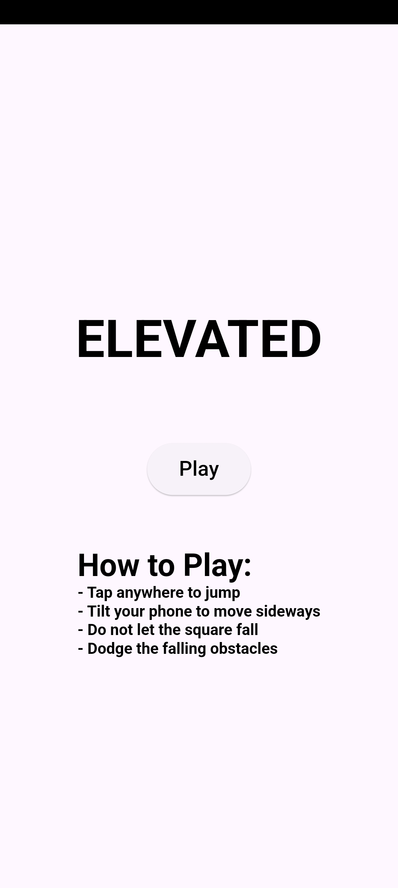
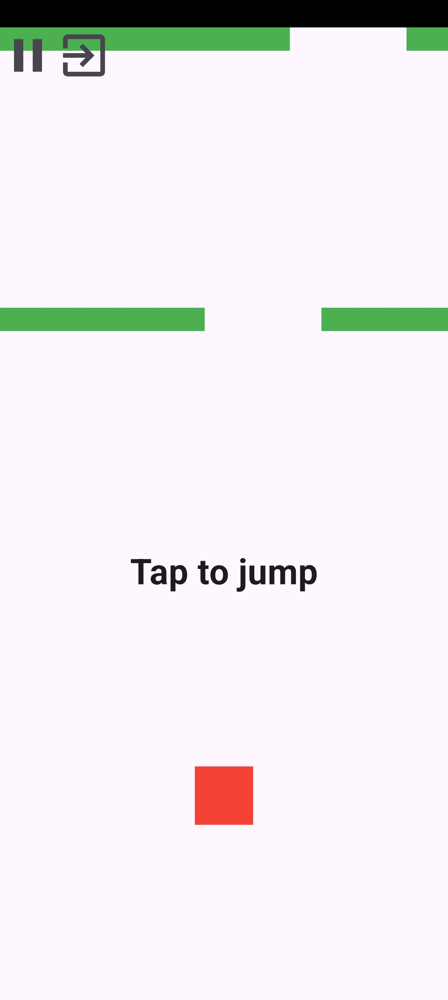
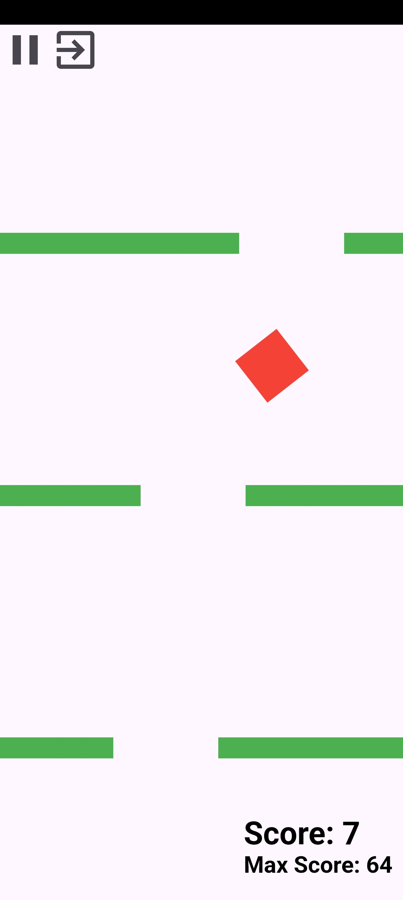
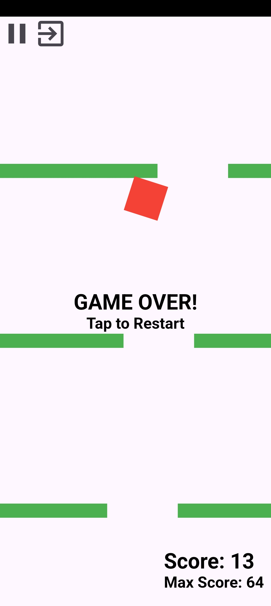

# Elevated game

## Idea
A simple game designed in flutter. The player controls a rotating square object. Obstacles fall from above.

## Instructions
- Tap anywhere to jump.
- Tilt your phone to move sideways.
- Do not let the square fall down.
- Dodge the falling obstacles.

## Screenshots

    
    

    
    

